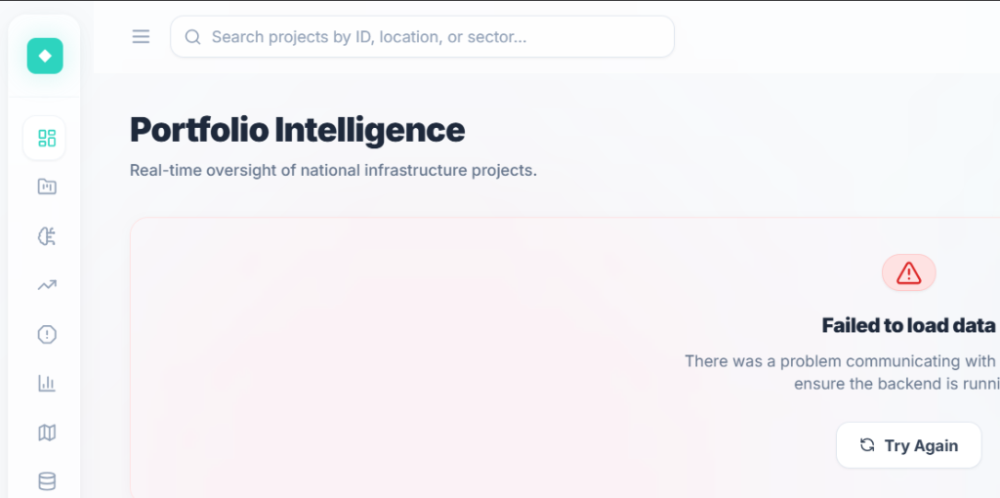

# Nirikshan — Monitor · Predict · Build Better

<div align="center">



**AI-Powered Predictive & Prescriptive Infrastructure Monitoring System**

[](https://nirikshan103.vercel.app)
[](https://sih103.onrender.com)

[](https://fastapi.tiangolo.com)
[](https://react.dev)
[](https://python.org)
[](https://scikit-learn.org)
[](https://supabase.com)
[](https://vercel.com)

> **SIH 2026 · Problem Statement 26103**  
> *Designed for the Ministry of Statistics and Programme Implementation (MoSPI)*

</div>

---

## ⚡ What is Nirikshan?

**Nirikshan** (Hindi: निरीक्षण — *Inspection / Surveillance*) is a full-stack, AI-driven intelligence platform that helps government officials monitor, predict, and intervene in at-risk national infrastructure projects. It processes data from 750+ projects across 20 Indian states and runs **four ML layers** to surface risk before it becomes a crisis.

```
┌─────────────────────────────────────────────────────────────────┐
│                       NIRIKSHAN ENGINE                           │
│                                                                  │
│  ┌──────────┐   ┌──────────┐   ┌──────────┐   ┌───────────┐   │
│  │ LAYER 01 │──▶│ LAYER 02 │──▶│ LAYER 03 │──▶│ LAYER 04  │   │
│  │ Digital  │   │Historical│   │  Risk    │   │Predictive │   │
│  │Fingerprint│  │Analogues │   │ Momentum │   │   + AI    │   │
│  │ (Rules)  │   │  (KNN)   │   │  (Δ/t)   │   │(RF + LLM) │   │
│  └──────────┘   └──────────┘   └──────────┘   └───────────┘   │
└──────────────────────────────────────────────────────────────────┘
```

---

## 🌐 Live Deployment

| Service | URL |
|---------|-----|
| **Frontend** (Vercel) | https://nirikshan103.vercel.app |
| **Backend API** (Render) | https://sih103.onrender.com |
| **Database** | Supabase PostgreSQL (managed cloud) |

> **Note for Judges:** The backend is hosted on Render's free tier. If the first request is slow (~30s), it's waking from idle. All subsequent requests are fast.

---

## 🎬 Feature Overview

| Page | Description |
|------|-------------|
| **Dashboard** | KPI command center — critical, high, rising risk counts |
| **Projects** | Full searchable/filterable table of all 750+ projects |
| **Project Dossier** | Per-project deep dive with all 4 ML intelligence layers |
| **Rising Risk** | Momentum-sorted early warning tracker |
| **Priority Queue** | Projects grouped by urgency requiring intervention |
| **Analytics** | Portfolio-level charts and risk distribution |
| **🗺️ Geospatial Map** | Interactive India choropleth — hover to see state name; colour-coded by risk/count |
| **Data Ingestion** | Upload CSVs to populate the system |

---

## 🏗️ System Architecture

```
┌──────────────────────────────────────────────────────┐
│                  VERCEL CDN (Frontend)                │
│          React 18 + Vite + Tailwind CSS               │
│         https://nirikshan103.vercel.app               │
└───────────────────────┬──────────────────────────────┘
                        │ HTTPS + CORS
                        │ axios + VITE_API_URL
┌───────────────────────▼──────────────────────────────┐
│               RENDER (Backend API)                    │
│         FastAPI + Uvicorn (Python 3.11)               │
│           https://sih103.onrender.com                 │
│                                                       │
│  ┌─────────────────────────────────────────────────┐ │
│  │              API Router  (/api/*)               │ │
│  │   /dashboard  /projects  /predictions           │ │
│  │   /geospatial  /ingestion  /prescriptions       │ │
│  └───────────────────┬─────────────────────────────┘ │
│                      │                               │
│  ┌───────────────────▼─────────────────────────────┐ │
│  │             ML Risk Engine                      │ │
│  │  engine · momentum · analogues · predictive     │ │
│  │  prescriptive (Google Gemini Flash 2.0)         │ │
│  └───────────────────┬─────────────────────────────┘ │
│                      │                               │
│  ┌───────────────────▼─────────────────────────────┐ │
│  │         SQLAlchemy ORM + .pkl Models            │ │
│  └─────────────────────────────────────────────────┘ │
└───────────────────────┬──────────────────────────────┘
                        │
┌───────────────────────▼──────────────────────────────┐
│              SUPABASE (PostgreSQL)                    │
│    projects · project_snapshots · milestones          │
│    issues · (auto-created on first startup)           │
└──────────────────────────────────────────────────────┘
```

---

## 🧠 The 4 Intelligence Layers

### Layer 01 — Digital Fingerprint `engine.py`
> Rule-based multi-dimensional health scoring

Converts raw project snapshot data into a **5-dimension health vector** scored 0–100:

| Dimension | Formula Logic |
|-----------|--------------|
| `progress_health` | Completion ratio vs. time elapsed, velocity |
| `financial_health` | Expenditure ratio, cost-progress divergence |
| `schedule_health` | Time overrun %, delay momentum |
| `milestone_health` | Milestone completion rate, delay rate |
| `overall_risk_score` | Weighted composite (0–100 scale) |

### Layer 02 — Historical Analogues `analogues.py`
> KNN-based pattern matching against completed project history

Finds the **5 most similar past projects** using K-Nearest Neighbours on the 5D fingerprint vector. Returns outcome probabilities (on-time, delayed, stalled) from their actual historical results.

### Layer 03 — Risk Momentum `momentum.py`
> Time-series velocity analysis (Δ risk / Δ time)

Calculates the **rate of change** of risk score across consecutive snapshots. A project with accelerating momentum (rising slope) is flagged as an early warning even if its current absolute risk is moderate.

### Layer 04 — Predictive ML + AI Prescription `predictive.py` + `prescriptive.py`
> Random Forest classifier + Google Gemini Flash LLM

- **Random Forest** classifies the project into `low / medium / high / critical` risk categories.
- **Gemini Flash 2.0** generates natural-language prescriptions — actionable, minister-ready intervention recommendations based on all 4 layers of context.

---

## 🔒 Security

| Layer | Measure |
|-------|---------|
| **Rate Limiting** | `slowapi` — 200 req/min global, 30 req/min on root |
| **Security Headers** | X-Content-Type-Options, X-Frame-Options, X-XSS-Protection |
| **HSTS** | `max-age=31536000` — HTTPS enforced for 1 year |
| **Content Security Policy** | Locks scripts/styles/API calls to known origins |
| **CORS** | Locked to `nirikshan103.vercel.app` + localhost only |
| **SQL Injection** | Prevented by SQLAlchemy ORM parameterised queries |
| **Server Fingerprint** | `Server` header removed from all responses |
| **Vercel Headers** | CSP, HSTS, X-Frame-Options enforced at CDN edge |

---

## 🗄️ Database Schema

```sql
projects            -- Project master data (state, sector, budget, dates)
project_snapshots   -- Monthly/periodic health snapshots (the fingerprint source)
milestones          -- Project milestone tracking
issues              -- Flagged project issues
```
> Tables are **auto-created on first startup** via `SQLAlchemy Base.metadata.create_all()`. No manual SQL needed.

---

## 🚀 Local Development Setup

### Prerequisites
- Python 3.11+
- Node.js 18+
- A Supabase project (or use SQLite locally)

### Backend
```bash
cd backend
python -m venv venv
.\venv\Scripts\activate         # Windows
pip install -r requirements.txt

# Create .env
echo "DATABASE_URL=sqlite:///./sih26103.db" > .env
echo "GEMINI_API_KEY=your_key_here" >> .env

uvicorn app.main:app --host 127.0.0.1 --port 8000 --reload
```

### Frontend
```bash
cd frontend
npm install

# Create .env
echo "VITE_API_URL=http://127.0.0.1:8000" > .env

npm run dev
```

> App runs at `http://localhost:5173`

---

## ☁️ Production Deployment

| Service | Provider | Config File |
|---------|----------|-------------|
| Frontend | Vercel | `frontend/vercel.json` |
| Backend | Render | `backend/render.yaml` |
| Database | Supabase | Managed PostgreSQL |

**Environment variables needed on Render:**
```
DATABASE_URL   = postgresql://...your supabase connection string...
GEMINI_API_KEY = your_gemini_api_key
PYTHON_VERSION = 3.11.0
```

**Vercel settings:**
- Root Directory: `frontend`
- Framework: Vite (auto-detected)
- No extra env vars needed (API URL is baked into `.env.production`)

---

## 📁 Project Structure

```
Nirikshan/
├── backend/
│   ├── app/
│   │   ├── api/router.py          # All API endpoints
│   │   ├── core/database.py       # DB engine + session
│   │   ├── ml/
│   │   │   └── risk_engine/
│   │   │       ├── engine.py      # Layer 01: Digital Fingerprint
│   │   │       ├── analogues.py   # Layer 02: Historical Analogues
│   │   │       ├── momentum.py    # Layer 03: Risk Momentum
│   │   │       ├── predictive.py  # Layer 04: Random Forest
│   │   │       └── prescriptive.py # AI (Gemini) Prescriptions
│   │   ├── models/                # SQLAlchemy ORM models
│   │   └── main.py                # FastAPI app + security middleware
│   ├── requirements.txt
│   └── render.yaml                # Render deployment blueprint
├── frontend/
│   ├── src/
│   │   ├── components/            # Reusable UI components
│   │   ├── pages/                 # Route-level page components
│   │   └── config/api.ts          # Centralised API base URL
│   ├── public/logo.png            # Nirikshan logo
│   ├── vercel.json                # Vercel + security headers config
│   └── .env.production            # Points to live Render API
└── docs/                          # Architecture, ML, API reference docs
```

---

## 📄 Documentation

| Document | Description |
|----------|-------------|
| [ARCHITECTURE.md](docs/ARCHITECTURE.md) | System design and component relationships |
| [ML_PIPELINE.md](docs/ML_PIPELINE.md) | Detailed ML layer documentation |
| [API_REFERENCE.md](docs/API_REFERENCE.md) | All REST endpoints with request/response schemas |
| [SETUP_GUIDE.md](docs/SETUP_GUIDE.md) | Local and production setup instructions |
| [SECURITY.md](docs/SECURITY.md) | Security measures and threat model |
| [DATASET_GUIDE.md](docs/DATASET_GUIDE.md) | Data schema and ingestion format |

---

## 👥 Team

**SIH 2026 · Team SIH26103**  
Problem Statement: AI-based monitoring system for national infrastructure projects  
Ministry: MoSPI (Ministry of Statistics and Programme Implementation)

---

<div align="center">

*Nirikshan — Monitor · Predict · Build Better*  
Built with ❤️ for Smart India Hackathon 2026

</div>
